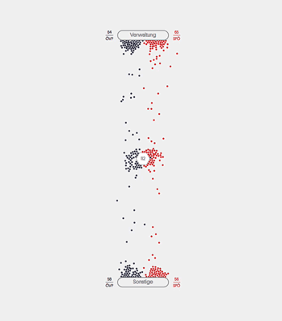

# Force radar scatterplot

A radar scatterplot chart powered by d3.force.



## Basic usage

### Install via npm

```
npm install qvvdata/force-radar-scatterplot
```

### Import in your script

```
import ForceRadarScatterplot from '../node_modules/force-radar-scatterplot/dist/ForceRadarScatterplot.min.js'
```
You can also import the unminified file if you want to see the code. The minified file includes a js.map.

### Instantiate the class

**Note: your holder must have a square format defined or the chart will not function properly.**

```
const ForceRadarScatterplotInstance = new ForceRadarScatterplot(
  document,
  '#chart-holder',
  customSettings, // Optional. You cannot set it later.
  data // Optional. You can set it later with .setData()
);
```

### Setting data/init/render

```
ForceRadarScatterplotInstance.setData()
	.init()
	.render();
```

If you don't have data yet and just want to see the chart in action I have provided random data in the class and you just need to call **fillWithRandomData()** after **init()**.

```
ForceRadarScatterplotInstance.init()
	.fillWithRandomData()
	.render();
```

## Chart Settings

```
// Delay between points when they change state.
delayBetweenPoints: 2,

// Global settings for all target options.
target: {
    // Background color.
    background: '#f3f3f3',
    borderColor: '#8B8B8B',
    borderRadius: 100,
    borderWidth: 2,

    // Text color.
    color: '#8B8B8B',

    // Font size of the label in the target.
    fontSize: 16,

    // Font size of the statistics labels.
    fontSizeStatistics: 12,

    // At which angle do we start placing targets.
    // The algorithm will start from there in a clockwise direction.
    startAngle: 90,

    // This moves the target center coordinate for the groups to the outside (postive number)
    // or to the center of the target element (negative). This allows you to move the target
    // centers of groups closer together or more wide apart.
    //
    // this is a floatnumber and it's a relative to the segment size.
    //
    // a segement is the distance between the target points, they are all equal.
    //
    // 0 does nothing and the point in very center of the target, if there is one, is never moved.
    groupTargetCenterOffset: 0,

    width: 150,
    height: 30,

    // The padding (in px) between Target box and Target statistics (left and right).
    offsetStatistics: 25,
},

// Global settings for the center target.
centerTarget: {
    // Text color.
    color: '#8B8B8B',

    // Fill of the hexagon.
    fill: '#FFF',

    // Font size of the number inside.
    fontSize: 14,

    // Size of the center hexagon icon.
    // This will be multiplied by the window.devicePixelRatio property when rendered.
    // We do not do it this in the settings because it will confuse the user if he ever inspects the settings and sees a different number
    // than to the actual one he has set.
    // On 4K screens we will also double te size because otherwise it is ridicuously small.
    hexagonSize: 40,
},

// Global options for points.
point: {
    radius: 2.5,

    // Fill for highlighting points
    highlightFill: '#FFF',

    // Color for border when highlighting.
    highlightStroke: '#000',

    // Width for the border when highlighting.
    highlightStrokeWidth: 1,

    // Upon load we initialize the points with a radius of 0
    // and animate them in to their size. This is the duration of that
    // animation PER point.
    initAnimationDuration: 750,

    // Upon load we initialize the points with a radius of 0
    // and animate them in to their size. This is the delay
    // between each point for that animation
    initAnimationDelayFactorBetweenPoints: 3,

    // The color that will be applied to points when they are set to inactive.
    inactiveColor: '#8B8B8B'
},

// Tooltips for points only.
tooltip: {
    // Are we showing tooltips?
    show: false,

    // Padding.
    padding: {
        top: 10,
        right: 10,
        bottom: 10,
        left: 10
    },

    // The formatter is a user supplied function that
    // will return the html for the tooltip when the
    // user hovers over a point.
    formatter: function tooltipFormatter() {
        return 'To be implemented by the user';
    }
},

// Collision detection options.
collisionDetection: {
    // While this is used for collision detection
    // this will actually effectively create padding
    // between the points. You can view it as an
    // invisible radius or bubble around the point.
    nodePadding: 1,

    // This property explains itself.
    ignoreCollisionWhenAlphaLowerThan: 0.075
},

// All the force properties work together to create a specific
// movement effect. It can be very difficult to get exactly what you want.
// I have set them to something that I think looks visually pleasing and natural
// but you can play with these properties until you get your desired effect.
force: {
    // This is increases the effect of the collision when points collide with the static poins (which we use only for collision detection).
    // We set the effect slightly higher so there is less chance of points flying through.
    // Still trying to figure why it keeps happening.
    staticCollisionRepulseFactor: 1.2,

    // Slows down the rate at which the node travels from its original position to its newly calculated position.
    // Lower values = MORE friction!!!
    friction: 0.91,

    // Strength of the attraction force towards it's destination point.
    gravity: 0.051,

    // “cooling parameter” that decrements at each tick
    // and reduces the effect each of the forces play on the position of the nodes.
    // Used only at the loading of the chart to put all the points in the middle.
    startAlpha: 0.1,

    // “cooling parameter” that decrements at each tick
    // and reduces the effect each of the forces play on the position of the nodes.
    alpha: 0.1

    // friction slows the nodes down at each tick, and alpha slows
    // them down between each tick. After a certain threshold is
    // reached for alpha, the force layout stops calculating, freezing
    // the graph into what is hopefully an optimal layout.
}
```

## Data

```
{
	// The targets where points can be moved to.
	targets: {
		id: String,
		title: String
	},

	// Groups which points can be part of.
	groups: {
		id: String,
		title: String,
		color: String (HEX/RGBA)
	},

	// The data points.
	points: {
		id: String,
		target: String, (Id of a target or FRC_CENTER_TARGET)
		group: String,  (Id of a group)

		// Active: point will be colored and count towards the statistics.
		// Inactive: point will be set to the inactive color from the global settings
		// and not be counted towards any statistics
		isActive: Boolean
	}
}
```

## Handling state changes

Having preset states for the points can be very usefull especially in scrollingtelling functionalities so we have an api to assist with that functionality.

Only state changes for existing points is supported.

### not supported
- Add/Remove points.
- Add/Edit/Remove Targets.
- Add/Edit/Remove Groups.

### api call

```
Frc.updatePoints(
	newPointState, // Object
	delayBetweenPoints = null
	forceAlphaValue = 0.1
)
```

The newPointState object is simply the same object config as you used in the set data.

**The id is required otherwise we don't know which point to update.**

You don't need to reset each property, only the one that has changed.

```
id: String, // Required
target: String, (Id of a target or FRC_CENTER_TARGET)
group: String,  (Id of a group)

// Active: point will be colored and count towards the statistics.
// Inactive: point will be set to the inactive color from the global settings
// and not be counted towards any statistics
isActive: Boolean

```

## API

### Misc

**# .startRandomLoopingAnimation(intervalTimeInMs = 50)**


Start an infinite animation where a random point gets a random target assigned. This will assign the interval id to the **loopingAnimationIntervalId** property.

**# .stopRandomLoopingAnimation()**

Stops the looping animation by clearing the interval id. Remember that even though the interval is cleared some points
will still be moving because they have not reached their destination or because some previous intervals have not yet
been called by javascript.

## License

[Attribution 4.0 International (CC BY 4.0)](https://creativecommons.org/licenses/by/4.0/)

See Licese.md for more info.
